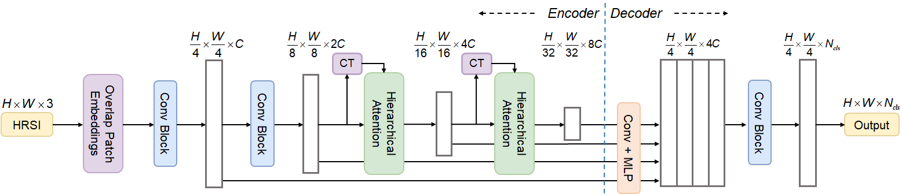

# This is the code for FSegNet

The paper is under review: "FSegNet: A semantic segmentation network for HRSIs that balances efficiency and performance".

## How to use?

* The project is built based on [MMSegmentation](https://github.com/open-mmlab/mmsegmentation):
    *  First download the [MMSegmentation](https://github.com/open-mmlab/mmsegmentation) and configure the required environment to run according to the official documentation. We recommend using MMSegmentation version 1.10.
    *  Copy the network and configuration files of the FSegNet to the corresponding locations in the MMSegmentation directory.
    *  The network components are registered according to the registration method of modules in the MMSegmentation manual.
* Data set processing:
    *  Follow the links provided in the official manual to download the Potsdam dataset and the Vaihingen dataset.
    *  Configure and run the processing code for the Potsdam dataset and Vaihingen dataset provided by the MMSegmentation. For example:`tools/dataset_converters/potsdam.py`
    *  Modify the data set configuration file. 
* Load the pre-trained model:
    *  Download the pre-trained model of FasterViT from this [project](https://github.com/NVlabs/FasterViT).
    *  In the `mmseg/models/backbones/fastervit.py` line 957 load the model file
* After the above steps, you can run `train.py`. If you need to modify hyperparameters, see the official documentation.

*Our model can be downloaded [here](https://drive.google.com/file/d/1b_fQTcZRVetaktSJQ0ffdCh_IBM-BdYG/view?usp=drive_link).*

**If there are any problems in use, please give me feedback.**
